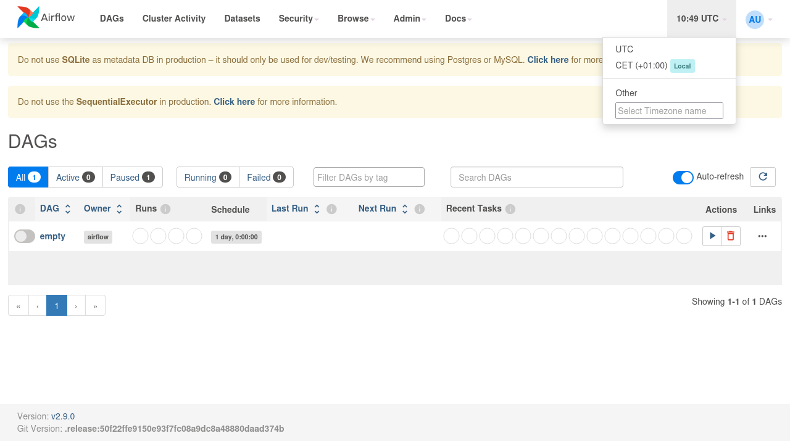
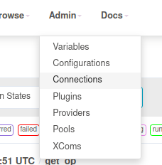

# Pour débuter

## Présentation des concepts principaux

https://airflow.apache.org/docs/apache-airflow/stable/tutorial/index.html#

## Préparation de l'environnement

Sous Windows

```pwsh
Set-ExecutionPolicy -ExecutionPolicy RemoteSigned -Scope LocalMachine
```

Source : [Microsoft Docs](https://learn.microsoft.com/en-us/powershell/module/microsoft.powershell.security/set-executionpolicy?view=powershell-7.4)

## Avertissement

La philosophie de la solution Apache AirFlow est d'être une solution de Workflow As A Code, il est donc indispensable de coder pour définir les différentes tâches et autres traitements.

https://airflow.apache.org/docs/apache-airflow/stable/index.html#why-not-airflow


# Exercice - Bien démarrer

Télécharger et installer Apache Airflow selon l'un des formats les plus adaptés.

Apache Airflow ne peut pas fonctionner nativement sous Windows. Les 3 modes d'installation possibles sont :

* Docker
* Installation native Linux
* Installation sous WSL

## Docker

```bash
docker run --name airflowlocal -p 8080:8080 -v localdagsfolder:/opt/airflow/dags apache/airflow:latest standalone
```

Vous pouvez aussi le démarrer en démon

```bash
docker run -d --name airflowlocal -p 8080:8080 -v /home/gael/Projects/argonaultes/education/airflowdags:/opt/airflow/dags apache/airflow:latest standalone
```

Ou bien créer un fichier docker-compose.yml

```bash
docker compose -f airflow.yml up -d
```

```yaml
services:
  airflowservice:
    image: apache/airflow:latest
    ports:
    - 8080:8080
    volumes:
    - /home/gael/Projects/argonaultes/education/airflowdags:/opt/airflow/dags
    command: standalone
```

Une fois démarré, vous devez récupérer le mot de passe administrateur généré par défaut.

```bash
docker exec airflowlocal cat /opt/airflow/standalone_admin_password.txt
```

Le nom d'utilisateur par défaut est admin.

## Native Linux

```bash
pip install apache-airflow
```

## WSL

1. Ouvrir un terminal ubuntu
2. `pip install apache-airflow`
3. `airflow standalone`

\newpage{}

# Préparation VS Code / Codium

Pour installer airflow en local pour avoir les informations sur les dépendances airflow

```bash
python -m venv airflowvenv
. ./airflowvenv/bin/activate
pip install apache-airflow
```

Puis dans VS Code / Codium, choisissez l'interpréteur Python disponible dans l'environnement virtual nouvellement créé avec apache airflow installé.

# Exercices prise de connaissance

## Créer un job vide

Aide : `EmptyOperator`

Solution

```python
from airflow import DAG
from airflow.operators.empty import EmptyOperator

with DAG(dag_id='empty'):
    EmptyOperator(task_id='empty_task')
```

Placer le script dans le dossier dags 

```bash
docker cp dags/empty.py airflowlocal:/opt/airflow/dags/
```

Si le DAG n'apparaît pas, se connecter avec Bash au container

```bash
docker exec -it airflowlocal bash 
```

Vérifier que le DAG a bien été lu

```bash
airflow dags list
```

Résultat attendu

```bash
dag_id | fileloc                    | owners  | is_paused
=======+============================+=========+==========
empty  | /opt/airflow/dags/empty.py | airflow | True     
```

Forcer la prise en compte du DAG

```bash
airflow dags reserialize
```

Possibilité ensuite de visualiser le DAG dans l'interface web




\newpage{}

## Créer un job qui se lance uniquement à la demande

Aide : `BashOperator`

Solution

```python
from airflow import DAG
from airflow.operators.bash import BashOperator

with DAG(
    dag_id='test1',
    schedule=None,
    is_paused_upon_creation=True):
    BashOperator(
        task_id='hello',
        bash_command='echo "hello world"')
```

\newpage{}


## Créer un job avec 2 étapes qui affichent étape 1 et étape 2.

Aide : `BashOperator`

Solution, qui utilise la syntaxe `@decorator`.

```python
from airflow.decorators import dag
from airflow.operators.bash import BashOperator
from airflow.models.baseoperator import chain
from airflow.utils.trigger_rule import TriggerRule

@dag()
def testdeco():
    t1 = BashOperator(
        task_id='testdecotask1',
        bash_command='echo "hello" && exit 1')
    t2 = BashOperator(
        task_id='testdecotask2',
        bash_command='echo "after task1"'
    )
    t3 = BashOperator(
        task_id='testdecotask3',
        bash_command='echo "triggered only on error"',
        trigger_rule=TriggerRule.ALL_FAILED
    )
    chain(t1, [t2, t3])
```

\newpage{}


## Créer un job qui se lance périodiquement, toutes les 5 minutes.

Aide : `EmptyOperator` et `DAG(schedule=...)` 

Solution, regarder la syntaxe de [Cron](https://en.wikipedia.org/wiki/Cron) qui exécute la tâche toutes les 20 secondes.


```python
from airflow import DAG
from airflow.operators.empty import EmptyOperator

from datetime import datetime as dt
from datetime import timedelta

with DAG(
    dag_id='empty_schedule_timedelta',
    schedule=timedelta(seconds=20),
    start_date=dt(2024,11,1),
    is_paused_upon_creation=False,
    catchup=False
    ):
    t1 = EmptyOperator(task_id='empty_task')
    t2 = EmptyOperator(task_id='empty_task_2')
    t1 >> t2

# * * * * * <command to execute>
# | | | | |
# | | | | day of the week (0–6) (Sunday to Saturday; 
# | | | month (1–12)             7 is also Sunday on some systems)
# | | day of the month (1–31)
# | hour (0–23)
# minute (0–59)


with DAG(
    dag_id='empty_schedule_cron',
    schedule='* * * * *', #
    start_date=dt(2024,11,1),
    is_paused_upon_creation=False,
    catchup=False
    ):
    t1 = EmptyOperator(task_id='empty_task')
    t2 = EmptyOperator(task_id='empty_task_2')
    t1 >> t2

with DAG(
    dag_id='empty_catchup_enabled',
    schedule='* * * * *',
    start_date=dt(2024,11,25),
    is_paused_upon_creation=False,
    catchup=True
    ):
    t1 = EmptyOperator(task_id='empty_task')
    t2 = EmptyOperator(task_id='empty_task_2')
    t1 >> t2
```

\newpage{}

## Lecture fichier local

Télécharger un fichier d'exemple [access.log.1](https://drive.proton.me/urls/0GB9K6EFBG#Lv0VaF2SiJsg)  et créer un job permettant de lire ce fichier.


Aide : PythonOperator, BashOperator

Solution

```python
from airflow import DAG
from airflow.operators.python import PythonOperator
from airflow.operators.bash import BashOperator

from datetime import timedelta
from datetime import datetime


def open_file():
    with open('/opt/airflow/data/access.log.1', 'r') as f:
        lines = f.readlines()
        print('\n'.join(lines))

with DAG(
    dag_id='readfile',
    schedule=timedelta(seconds=30),
    start_date=datetime.now(),
    is_paused_upon_creation=False
):
    t_file_bash = BashOperator(
        task_id='t_file_bash',
        bash_command='cat /opt/airflow/data/access.log.1'
    )
    t_file_python = PythonOperator(
        task_id='t_file_python',
        python_callable=open_file
    )
```

\newpage{}


## Lecture fichier http

Créer un job permettant de lire un fichier disponible à l'addres HTTP ci-dessous avec le binaire `wget`.

```bash
http://51.159.150.224/assets/access.log.1
```


Créer un second job permettant de lire un fichier disponible à l'adresse HTTP avec l'opérateur `HttpOperator`.

Solution, attention à bien créer la connexion http dans l'interface Admin > Connections



```python

```
\newpage{}


## Lecture données API public

Créer un job permettant de lire une API public. Le point d'accès à cette API est `http://51.158.96.198:8080/lastprofile`.

Pour créer une connexion dans Apache Airflow en CLI, le lien vers la [documentation](https://airflow.apache.org/docs/apache-airflow/stable/howto/connection.html)

Solution URI

```bash
airflow connections add 'http_api_test' --conn-uri 'http://51.158.96.198:8080/http'
```

Aide : `HttpOperator` et/ou `BashOperator`

Solution Transfert information entre tâches

[XCom](https://airflow.apache.org/docs/apache-airflow/stable/core-concepts/xcoms.html)

Exemple de code pour récupérer la valeur par défaut return_value stockée par l'une des tâches précédentes

```python
# Pulls the return_value XCOM from "pushing_task"
value = task_instance.xcom_pull(task_ids='pushing_task')
```

Solution Script Python

```python

```
\newpage{}


## Charger des données dans une base de données relationnelle

Créer un job qui charge des données dans une base de données relationnelle


Aide : `PostgresOperator`


Pour créer une instance de base de données relationnelle, inspirez-vous du fichier yaml interprétable par docker compose.

Solution 1 :

```yaml

```

Pout utiliser le fichier yaml correspondant :

```bash
```

Solution 2 : 
Utilisez la commande suivante `docker run` pour créer le nouveau container au même niveau que le container `airflow`:

```bash
```

Solution 3 :
Créer un docker-compose déclarant les services airflow et postgresql.

```yaml

```

Une fois l'instance démarrée, il est possible de s'y connecter avec l'outil CLI disponible dans le même container

```bash
```

Pour charger des données, créer une table contenant une unique colonne de type text.

```sql
```

Il faut préparer Airflow en déclarant la connexion à la base de données commandes.

```bash
```

Solution

```python

```

\newpage{}

## Alimenter un fichier puis le charger

Aide : `PostgresOperator`, `PythonOperator`

Partager un même volume entre le service postgres et le service airflow. Dans ce volume, créer un fichier `data.csv` initialisée avec seulement les en-têtes. Ce volume doit être disponible depuis les 2 conteneurs via le chemin `/tmp/inputfiles/`.

```csv
temperature;humidity

```

```bash
```

Solution

```python
```

\newpage{}

## Détecter qu'un fichier a été ajouté

Aide : `FileSensor`

Solution

```python

```

\newpage{}

## Supprimer/Conserver une/plusieurs colonne/s

Créer un job qui lit un fichier, qui supprime une colonne de ce fichier puis charge le résultat dans une base de données relationnelle.

Etapes :

1. Lire le fichier
1. Séparer en colonnes
1. Conserver les colonnes 1, 4 et 5
1. Charger les colonnes 1, 4 et 5 dans une table adéquate

Aide : `BashOperator`, `PostgresOperator`, `PythonOperator`

Création de la connexion `postgres_commandes_26`

```bash
```

Télécharger manuellement le ficher de log dans le dossier `/tmp/inputfiles/`.

```bash
```

En cas de problème de droits, créer en avance le fichier vide `keepcoldata.csv` et donner les droits de modification à tout le monde.

```bash
```


Solution avec `BashOperator` suivant ETL

```python


```

Solution avec `PythonOperator` suivant ETL

```python
# TODO
```

Solution avec `BashOperator` suivant ELT

```python
# TODO
```

Solution avec `PythonOperator` suivant ELT

```python

```

\newpage{}


## Déclencher un traitement à la mise à jour d'un dataset

A la mise à jour d'un fichier, déclencher le rechargement de ce fichier dans la base de données relationnelle.

Aide : `Data-aware scheduling`, `PostgresOperator`

Pour en savoir plus sur [Data-aware scheduling](https://airflow.apache.org/docs/apache-airflow/stable/authoring-and-scheduling/datasets.html).

Une URI doit respecter la [RFC3986](https://www.rfc-editor.org/rfc/rfc3986).

Solution

```python

```

\newpage{}


## Tout mettre en majuscule

Créer un job qui met en majuscule toutes les données de la colonne message d'une table d'audit dans une base de données.

Aide : `PostgresOperator`

Ce doit être un DAG à part qui sera déclenché à chaque fois que la table d'audit est mise à jour.

Solution

```python

```

Ajouter la ligne `outlets=[audit_log_elt_dataset]` dans la tâche loadData

```python

```
